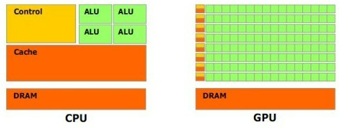

# GPU

### GPU란?

- 'Graphics Processing Unit', 그래픽 처리 장치의 줄임말
- 그래픽 카드를 구성하는 가장 중요한 요소
- 과거에는 이미지를 화면으로 그리는 것에 불과 했으나 현재는 3D 그래픽이나 단순 계산 등에서 CPU를 능가하고 CPU와 비슷하게 중요한 역할을 하고 있음

### GPU 구조

- CPU의 내부의 많은 부분은 캐시 메모리로 채워짐
- CPU가 처리할 것을 RAM에서 불러와 임시로 Cache Memory에 저장해 처리 속도를 높임
  - 현재의 CPU들은 DRAM들에 비해 속도가 많이 빠르다보니 DRAM이 성능이 낮아 병목현상이 발생, 이것을 속도고 빠른 SRAM인 Cache Memory에 임시로 저장해 처리 속도를 높히는 구조
- 반면 GPU는 여러 명령어를 한꺼번에 처리하는 병렬 방식을 사용하여 동시에 계산