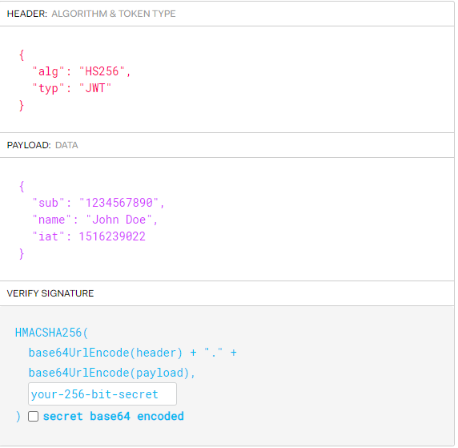

# JWT와 session 기반 인증의

### JWT

JWT는 JSON Web Token의 약자로써 세션에 사용자 데이터를 저장하는 전통적인 쿠키 세션 방식과 다르게 json 객체에 사용자 정보의 일부를 담는다.

### 기존 쿠키 세션 동작 방식과 문제점

쿠키 세션 방식을 사용해야하는 이유를 이해하기 위해선 HTTP 프로토콜의 특성을 이해할 필요가 있다.

##### Stateless

HTTP 프로토콜은 클라이언트와 서버의 통신이 끝나자마자 상태 정보를 잊어버린다.  예를 들어 USER1이 방금 전까지 서버와 통신을 했더라도 연결이 끊기자마자 USER1이 누구인지 까먹어버리고 다시 클라이언트의 정보를 요구하는 것이다. 페이지를 이동할때마다 내가 누구인지 확인하는 로그인창이 뜨면 매우 귀찮을 것이다. 이를 해결하기 위해서 세션과 쿠키라는 기술을 사용한다.

##### 로그인 과정

세션은 서버의 메모리에 생성되는 저장 공간이다. 이 안에 로그인한 유저의 정보가 저장이 된다. 세션에 저장된 정보에는 고유의 세션ID가 부여된다. 사용자가 로그인을 하면 서버는 쿠키에 세션ID를 실어서 브라우저에게 보내준다.

브라우저는 쿠키를 쿠키저장소에 가지고 있다가 다음 페이지를 요청할 때 해당 유저의 쿠키를 다시 요청의 헤더에 포함해서 전송한다. 서버는 쿠키 내부의 세션ID를 통해 세션 내부에 일치하는 유저 정보를 가져와서 처음에 로그인한 유저가 맞는지 확인한다. 페이지가 이동할때마다 이 작업이 반복되고 로그인한 상태가 유지되는 것이다.

### 문제점

- 저장 공간의 용량
  - 세션은 서버의 메모리 내부에 저장이 된다. 유저가 한두명일때야 메모리에 무리가 가지 않겠지만 유저가 수천명인 대형 서비스에서는 세션의 양이 많아지는 만큼 메모리에 부하가 걸릴 수 있다.
- 확장성의 문제
  - 서비스의 규모가 커져서 서버를 여러대로 확장 및 분산해야 한다면 세션을 분산시키는 기술을 따로 설계해야 한다.

### 세션쿠키의 대체재로서의 JWT

##### JWT의 구조

- HEADER

  - 헤어에는 토큰의 종류와 SGINATURE 생성을 위해서 어떤 알고리즘을 사용했는지가 명시되어 있다.

- PAYLOAD

  - 페이로드에는 내가 로그인한 유저임을 증명할 수 있는 기본적인 정보들을 넣는다. 차후에 클라이언트가 다시 토큰을 보내면 해독해서 DB내의 유저 정보와 비교하낟.

- SIGNATURE

  - Signature는 토큰을 인코딩하거나 유효성 검증을 할 때 사용하는 고유한 암호화 코드이다. 서명은 위에서 만든 헤더와 페이로드의 값을 각각 BASE64로 인코딩하고, 인코딩한 값을 내가 설정한 비밀키를 이용해 헤더에서 정의한 알고리즘으로 해싱을 하고, 이값을 다시 BASE64로 인코딩하여 생성한다. 혹시라도 토큰이 제 3자에 의해 탈취되어서 페이로드의 내용이 변경된다면 토큰의 값이 크게 변경된다.

  

##### JWT의 장단점

**장점**

JWT를 이용하면 따로 서버의 메모리에 저장 공간을 확보할 필요가 없다. 서버가 토큰을 한번 클라이언트에게 보내주면 클라이언트는 토큰을 보관하고 있다가(가장 쉬운 방법은 localstorage에 저장하는 것이다) 요청을 보낼때마다 헤더에 토큰을 실어보내면 된다. 쿠키를 사용할 수 없는 모바일 어플리케이션에서는 JWT를 사용한 인증방식이 최적이다.

**단점**

JWT는 HTTP를 통해서 전송하기 떄문에 페이로드의 크기가 클수록 데이터 전송에 있어서 비용이 커진다. JWT는 유효기간을 따로 정하지 않는 이상 소멸되지 않기 때문에 장기간 방치시 해킹의 위험이 커진다.

또한 JWT를 localstorage에 보관한다면 XSS공격에 취약해진다.

보통 httpOnly가 설정되서 브라우저만 접근 가능한 쿠키에 토크을 실어보내서 XSS 공격을 막는다.