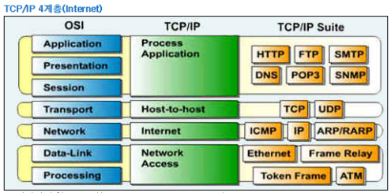

# OSI 7계층, TCP/IT 4계층

### 1. OSI 7계층

- 이 모형을 이용하면 특정 네트워킹 시스템에서 일어나는 일을 계층을 활용해 시각적으로 쉽게 설명
- 덕분에 네트워크 관리자는 어떤 문제의 원인이 어디에 있는지 범위를 좁힘
- 예를 들어 물리적인 문제인지 아니면 응용 프로그램과 관련이 있는지 쉽게 파악
- 이는  응용프로그램 개발 시 다른 어떤 계층에 작업이 필요한지 쉽게 파악 가능
- IT 기업은 고객에게 신제품을 설명할 때 OSI 모형을 많이 활용
- 해당 제품이 어떤 계층에서 작동하는지 아니면 "스택 전체에 걸쳐" 작동하는지 설명
- OSI모델은 1970년대에 등장한 2가지 별도 모형을 1983년에 합쳐 1984년에 처음 공개

**7계층 - 응용 계층**

>OSI 모형에서 "최종 사용자에게 가장 가까운" 계층
>
>7층에서 작동하는 응용프로그램은 사용자와 직접적인 상호작용
>
>크롬, 파이어폭스, 사파리 등 웹 브라우저 / 스카이프, 아웃룩, 오피스 등 응용 프로그램

- 사용자와 가장 밀접한 계층, 인터페이스 역할
- 응용 프로세스 간의 정보 교환 담당 / 전송 단위 : Message
- EX : 전자 메일, 인터넷, 동영상 플레이어 등의 Application

**6계층 - 표현 계층**

> 응용 계층의 데이터 표현에서 독립적인 부분
>
> 응용프로그램이나 네트워크를 위해 데이터를 "표현"하는 것
>
> 데이터를 안전하게 전송하기 위한 암호화, 복호화가 대표적

- 전송하는 데이터의 인코딩, 디코딩, 암호화, 코드 변환 등을 수행

- 데이터의 변환 작업을 하는 계층

**5계층 - 세션 계층**

> 2대의 기기, 컴퓨터 또는 서버 간의 세선을 만드는 작업
>
> 설정, 조율, 세션 마지막에 응용프로그램 간의 종료 등의 기능 필요

- 통신장치 간 상호작용 및 동기화를 제공
- 연결 세션에서 데이터 교환, 에러 발생시 복구 관리 => 논리적 연결 담당
- 4계층 장비 : NetBIOS(세션 내 연결관리 및 에러감지, 복구 수행), SSH, Appletalk(Port는 4~5계층 경계 모호)
- 응용 프로그램 간의 연결을 지원해주는 계층

**4계층 - 전송 계층**

> 최종 시스템 및 호스트 간의 데이터 전송 조율 담당
>
> 보낼 데이터의 용량, 속도, 목적지 등 처리
>
> 가장 잘 알려진 것이 전송 제어 프로토콜(TCP)

- 종단 간 신뢰 성 있고 정확한 데이터 전송을 담당
- 4계층에서 전송 되는 단위 => 세그먼트, 종단 간의 에러 복구와 흐름 제어 담당
- 4계층 장비 : L4 스위치
- 서비스를 구분하고 데이터의 전송 방식을 담당하는 계층

**3계층 - 네트워크 계층**

> 라우터 기능 대부분에 네트워크 계층
>
> 다른 여러 라우터를 통한 라우팅을 비롯한 패킷 전달을 담당

- 중계 노드를 통하여 전송하는 경우, 어떻게 중계할 것인가를 규정
- 데이터를 목적지까지 가장 안전하고 빠르게 전달
- 3계층 장비 : 라우터, L3 스위치
- 네트워크를 논리적으로 구분하고 연결하는 계층 - 논리적 주소 사용

**2계층 - 데이터 링크 계층**

> 노드 간 데이터 전송을 제공, 물리 계층의 오류 수정
>
> 2개의 부계층 존저(매체 접근 제어계층, 논리적 연결 제어 계층)

- 물리적은 연결을 통하여 인접한 두 장치간의 신뢰성 있는 정보 전송을 담당
- 정보의 오류와 흐름을 관리. 안정된 정보 전달
- 2계층 장비: 브릿지, 스위치

**1계층 - 물리 계층**

> 시스템의 전기적, 물리적 표현을 나타냄
>
> 케이블의 종류, 무선 주파수, 링크, 핀 배치, 전압, 물리 요건 등 포함
>
> 네트워킹 문제가 발생하면 물리 계층의 케이블 연결, 스위치, 플러그 확인

- 전기적, 기계적 특성을 이용하여, 통신 케이블로 전시적 신호를 전송
- 단지 데이터 전달 역할만을 하고, 알고리즘, 오류 제어 기능 존재X
- 1계층 장비 : 리피터, 허브, 케이플
- 신호로 변환하여 전송하는 계층

### 2. TCP/IP Protocol (4계층)

- 현재 인터넷에서 컴퓨터들이 서로 정보를 주고 받는데 쓰이는 통신규약(프로토콜)의 모음
- 1960년대 말 미국방성의 연구에서 시작, 1980년대 초 프로토콜 모델 공개
- 하드웨어, 운영체제, 접속매체 관계없이 동작할 수 있는 개방성을 가짐

**4계층 - Application Layer**

> OSI 7 Layer에서 세션계층, 프레젠테이션계층, 에플리케이션 계층에 해당(5, 6, 7 계층)
>
> 응용프로그램들이 네트워크서비스, 메일서비스, 웹서비스 등을 할 수 있도록 표준적인 인터페이스 제공

- TCP/IP 기반의 응용 프로그램을 구분할 때 사용
- 프로토콜 : HTTP, FTP, Telnet, DNS, SMTP

**3계층 - Transport Layer**

> OSI 7 Layer에서 전송계층에 해당
>
> 네트워크 양단의 송수신 호스트 사이에서 신뢰성 있는 전송기능 제공
>
> 시스템의 논리주소와 포트를 가지고 있어서 각 상위 계층의 프로세스를 연결해서 통신
>
> 정확한 패킷의 전송을 보장하는 TCP와 정확한 전송을 보장하지 않는 UDP 프토토콜을 이용
>
> 데이터의 정확한 전송보다 빠른 속도의 전송이 필요한 멀티미디어 통신에서 UDP를 사용하면 TCP보다 유용하다.

- 통신 노드 간의 연결을 제어하고, 자료의 송수신을 담당
- 프로토콜 : TCP, UDP

**2계층 - Internet Layer**

> OSI 7 Layer의 네트워크 계층에 해당
>
> 인터넷 계층의 주요 기능은 상위 트랜스포트 계층으로부터 받은 데이터에 IP패킷 헤더를 붙여 IP패킷을 만들고 이를 전송

- 통신 노드 간의 IP 패킷을 전송하는 기능 및 라우팅 기능을 담당
- 프로토콜 : IP, ARP, PARP, ICMP, OSPF

**1계층 - Network Access Layer**

> OSI 7 Layer에서 물리계층과 데이터링크 계층에 해당
>
> OS의 네트워크 카드와 디바이스 드라이버 등과 같이 하드웨어적인 요소와 관련되는 모든 것을 지원하는 계층
>
> 송신측 컴퓨터의 경우 상위 계층으로부터 전달받은 패킷에 물리적인 주소는 MAC 주소 정보를 가지고 있는 헤더를 추가하여 프레임을 만들고, 프레임을 하위계층인 물리계층으로 전달
>
> 수신측 컴퓨터의 경우 데이터 링크 계층에서 추가된 헤더를 제거하여 상위 계층인 네트워크 계층으로 전달

- CSMA/CD, MAC, LAN, X25, 패킷망, 위성 통신, 다이얼 모뎀 등 전송에 사용
- 프로토콜 : Ehternet(이더넷), Token Ring, PPP

### OSI 모델과 TCP/IP 모델 비교

- TCP/IP 프로토콜은 OSI 모델보다 먼저 개발되었다. 그러므로 TCP/IP 프로토콜의 계층은 OSI 모델의 계층과 정확하게 일치하지 않는다.

- 두 계층을 비교할 때 , 세션(Session)과 표현(presentation) 2개의 계층이 TCP/IP프로토콜 그룹에 없다는 것을 알 수 있다.

- 두 모델 모두 계층형 이라는 공통점을 가지고 있으며 **TCP/IP는 인터넷 개발 이후 계속 표준화되어 신뢰성이 우수**인 반면, OSI 7 Layer는 표준이 되기는 하지만 실제적으로 구현되는 예가 거의 없어 신뢰성이 저하되어있다.

- OSI 7 Layer는 장비 개발과 통신 자체를 어떻게 표준으로 잡을지 사용되는 반면에 실질적인 통신 자체는 TCP/IP 프로토콜을 사용한다.