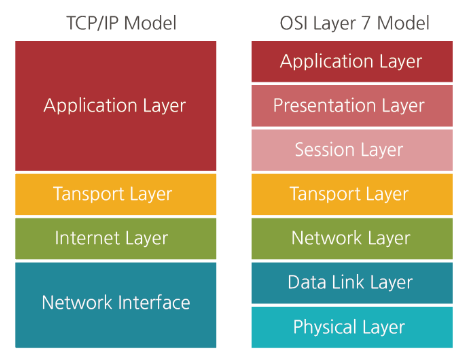

# protocol

#### 프로토콜이란?

> 서로 다른 시스템 및 기기 간 데이터 교환을 원활히 하기 위한 표준화된 통신 규약

기기 간 통신은 교환되는 데이터 형식에 대해 상호 협의를 요구하기 때문에 프로토콜이 필요한 것이며, 공통의 데이터 교환 방법이나 순서에 대해 정의한 약속, 규칙 체계를 의미한다. 따라서 동일한 프로토콜을 사용하면 기종 및 프로그램이 다르더라도 컴퓨터 간 상호 통신이 가능하다. 따라서 두 기종 간 정보 통신을 하기 위해 표준 프로토콜을 채택하여 통신망을 구축해야 한다.

### 프로토콜의 기본 요소

> 기본 요소는 크게 구문, 의미, 타이밍 세 가지가 있다.

| 기본요소       | 설명                                                         |
| -------------- | ------------------------------------------------------------ |
| 구문(Syntax)   | 데이터의 형식이나 부호화 및 신호 레벨을 규정한 것            |
| 의미(Semantic) | 전송의 조작이나 오류 제어를 위한 제어 정보에 대한 규정       |
| 타이밍(Timing) | 접속되어 있는 개체 간의 통신 속도의 조정이나 메세지의 순서 제어 등을 규정 |

### 프로토콜 특징

1. **주소지정** 컴퓨터가 다른개체로 데이터를 전송할 경우 상대방의 주소를 알아야한다. 주소지정방식에는 대표적으로  IP가 있다. IP는 네트워크에서 다른 개체를 식별하기 위한 주소를 부여하고 사용자가 별도로 변경할 수 있다.

2. **순서지정** 프로토콜의 기본요소 중 하나로, 데이터단위의 통신을 할 때 전송순서를 명시한다. 만약 전송시 오류가 발생할 경우 해당 데이터가 뭔지 구분할 수 있으며 전체적인 흐름제어를 할 때에도 사용한다.

3. **단편화와 재조립** 데이터를 전송할 때 용량이 커서 한번에 보내기 힘든 경우에 사용한다. 이 경우 대용량 파일의 패킷을 일정크기로 분할해서 전송한 수 수신측에서 원래대로 합치는 방식으로 전달한다.

4. **흐름제어** 송신측에서 전달된 데이터의 양이나 속도를 제어하는 기능이다. 수신측에서 허용할 수 없는 용량의 데이터를 보낼 경우, 데이터 손실이나 오류 등 여러 문제점이 생길 수 있다. 

   이를 방지하기 위해 흔히 사용하는 두 가지 방법이 있다. 송신측에서는 전송을 멈추고 수신측의 응답을 기다리는 [정지-대기] 방식이나, 수신측에서 한번에 허용할 수 있는 용량을 미리 물어보는 [슬라이딩윈도우] 방식을 사용한다.

5. **오류제어** 데이터 교환 시 발생하는 오류를 확인하는 기능이다. 보통 패리티비트 방식으로 오류를 검출하며 오류가 발견되어 처리되는 방식으로는 오류가 발생한 부분만 송신측에 재전송을 요청하거나, 수신측에서 직접 오류를 복수할 수도 있다.
6. **연결제어** 데이터를 전송할 때는 연결 / 비연결 두 가지 방식을 사용한다. 연결형 방식에는 TCP가 주로 사용되며 연결 후 지속적인 통신이 일어나고 수신측과 응답을 주고받기 때문에 순서가 보장된다. 반면, 비연결방식으로는 UDP가 사용되며 수신측의 응답을 받지 않고 수신측에서 일방적으로 데이터를 전송한다.
7. **동기화** 데이터를 주고 받는 두 매체가 전송시 타이머나 인자값 등 자원을 공유하는 것이다. 예를 들면 동기화 된 두 매체가 서로의 데이터나 인자값을 일치시킨다. 이후 한쪽의 데이터를 삭제한 뒤 다시 동기화를 이루면 반대쪽에서도 데이터가 지워진다.
8. **캡슐화** 프로토콜에서 캡슐화는 데이터를 전송하기 전 OSI 각 계층에서 송수신자의 주소나 오류검출코드 등 여러 제어정보를 덧붙이는 것을 말한다. 데이터를 전송하면 OSI 최상위 계층인 응용계층에서 물리계층까지 내려오면서 필요한 제어정보를 추가한다.

### 프로토콜 계층 구성

> 프로토콜 계층은 기본적으로 데이터 전송제어에 관한 계층, 통신 처리에 관한 계층으로 나뉜다. 세계적으로 프로토콜 표준화가 시도됐고, 가장 대표적인 것은 국제 표준화기구 ISO에서 정한 OSI 7계층이다.

##### OSI 7계층

물리, 데이터링크, 네트워크, 트랜스포트, 세션, 프레젠테이션, 응용 계층으로 정의돼 있다. 각 계층은 서로 독립적으로 구성돼있으며 하위 계층을 이용해 상위 계층에 기능을 제공한다.

