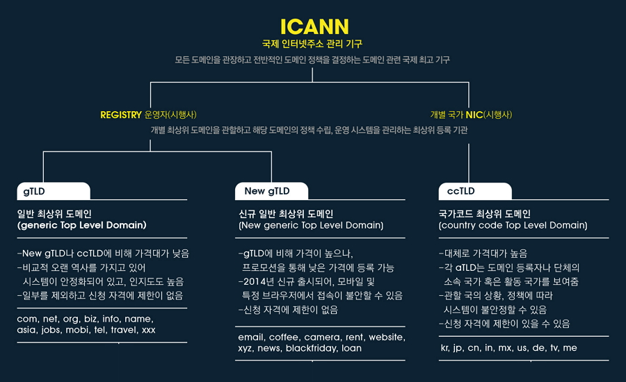
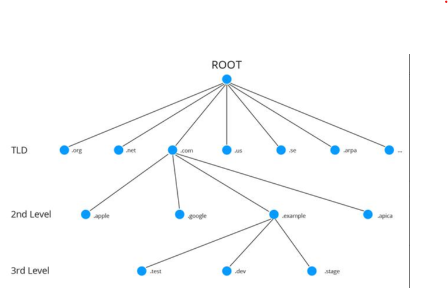

# 도메인 개념정리

### 도메인이란?

도메인은 인터넷에 연결된 컴퓨터의 ip를 사람이 쉽게 기억하기 어렵기때문에 이를 위해서 각 ip에 사람이 쉽게 기억하고 입력할 수 있도록 문자(영문, 하글 등)로 만든 인터넷 주소이다.

### 도메인 체계

도메인은 "`.`" 또는 루트(root)라 불리는 도메인 이하에 아래 그림과 같이 역트리(Inverted tree)구조로 구성되어 있다. 아래와 같이 3단계로 구분된다.

**1단계 : 최상위 도메인(TLD, Top-Level Domain)**

도메인 레벨 중에 가장 높은 단계에 있는 도메인이다. 7개의 일반 도메인(com, net, org, edu, gov, mil, int)과 190여개의 국가 도매인(ker de, jp..)으로 구성되어 있다.

1단계 도메인은 도메인의 목적, 종류, 국가를 나타낸다. 최상위 도메인의 형태에 따라 도메인 네임 체계와 등록 원칙이 다를 수 있다.

|      | gTLD                                                         | coTLD                                                        | New gTLD                                                     |
| ---- | ------------------------------------------------------------ | ------------------------------------------------------------ | ------------------------------------------------------------ |
| 정의 | 일반 최상위 도메인                                           | 국가코드 최상위 도메인                                       | 신규 일반 최상위 도메인                                      |
| 설명 | 전세계 누구나 사용가능                                       | 국가/지역 등을 나타냄 해당 국가, 지역에 거주하는 단체나 개인만이 취득 가능 | 기존 gTLD의 수량적 한계로 새로운 gTLD를 만들어냄             |
| 예시 | com, net, org, biz, info, name, aisa, jobs, mobi, tel, travel, xxx | kr, jp, cn, in, mx, us, de, tv, me                           | email, coffe, camera, rent, website, xyz, news, blackfriday, loan |

**2단계 : 차상위 도메인(SLD, Second-Level Domain)**

도메인 이름을 등록한 조직을 나타낸다. 예를 들어, 단과 대학과 학술 시설은 ac, 회사는 co와 같은 형태를 가지고 있다.

**3단계 : 도메인 이름(Domain Name)**

자주 볼 수 있는 naver, google, daum과 같이 우리가 임의로 지정할 수 있는 자율적인 이름을 의미한다.

